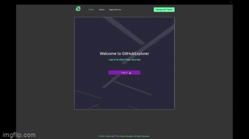

# Gitexplorer

## Introduction

This web application allows users to browse public GitHub repositories using a personal access token. After logging in with the personal access token, users can view a list of public GitHub repositories and navigate to a details page for each repository. The details page displays additional information about the repository and lists issues related to that repository, sorted by the number of comments. Users can also navigate through the list of issues.

## Website

You can access the live [website](https://yevhenii-bezeha.github.io/new-project/).

## Features

- **GitHub API Integration**: The application integrates with the GitHub API to fetch public data.

- **Pagination**: Repositories, issues, and users are paginated for enhanced user experience. You can choose how many items per page to display.

- **Error Handling**: The application verifies the validity of the provided API token and displays meaningful error messages if necessary.

- **API Token Management**: Users can change the API token by clicking on the "Change API token" link, allowing for easy token updates.

- **Token Security**: The API token is not persisted and needs to be entered anew after a full page reload.

- **Latest Angular Version**: The project is built using the latest version of Angular and takes advantage of modern Angular features.

- **Styling**: The application uses CSS for styling, providing a visually appealing and responsive design.

- **Linting**: The project follows great linter rules to maintain code quality.

- **Unit and E2E Tests**: The project is thoroughly covered by both unit and end-to-end tests to ensure code quality and reliability.

- **CI/CD Integration**: Gitexplorer is integrated with a Continuous Integration and Continuous Deployment (CI/CD) pipeline for automated testing and deployment.

## Usage 

1. **Login**: Upon opening the application, you will be prompted to log in using your GitHub personal access token.

2. **Repository List**: After logging in, you'll see a list of public GitHub repositories. You can specify how many repositories are displayed per page.

3. **Repository Details**: Clicking on a repository will take you to a details page, where you can view information about the repository, including stars, watchers, forks, and the owner.

4. **Issues**: The repository details page also displays a list of issues related to the repository, sorted by the number of comments. You can navigate through the list of issues.

5. **Changing API Token**: To change your API token, click on the "Change API token" link in the top right corner of the application. Submit the form to update the token.

## Security

Your GitHub API token is not saved anywhere, ensuring the security of your token. You will need to enter your API token every time you visit the webpage.

## Technologies Used

- Angular 
- RxJS 
- Angular Router 
- ReactiveFormsModule 
- CSS 
- Nx 
- Cypress 
- ESLint

## Roadmap

- End users section
- Add wiki documentation
- Add more user's interaction
- Add test code coverage
- Add accessibility support

## UX Design
We've focused on creating a beautiful and intuitive design for the best user experience. Tooltips are provided throughout the application to guide you.

## Contributing
We welcome contributions to this project. If you'd like to contribute, please fork the repository, make your changes, and submit a pull request.

## Credits
This project is built using the Nx workspace, providing a solid foundation for development.

## 🚀 About Me
I'm a Ex-medical professional turned software developer with analytical and problem-solving skills. Proficient in Angular, React, Cypress familiar with Node.js, Electron fluent in English, learning German. Committed to continuous learning and teamwork.
